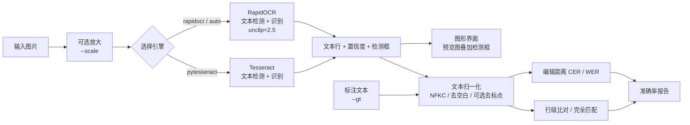

# 图片文字识别（OCR）与准确率评估

> ### 📚 课程作业说明
>
> 本项目为 **人工智能（AI）课程作业**的提交作品，选题方向为 **图片文字识别（OCR）**。
>
> 作业要求是搭建一套完整的识别流程，并**用可量化的指标评估识别效果**——因此本项目除了"能识别出文字"，
> 还实现了字符 / 词 / 行三级准确率、置信度统计与逐行差异定位，并附有调参对照实验数据（见下方「实验」章节）。
>
> | 项目 | 内容 |
> | --- | --- |
> | 课程名称 | `人工智能素养`（请自行填写） |
> | 作业类型 | 个人作业 |
> | 原创声明 | 使用dsf4生成

---

一个基于 Python 的 OCR 小工具：识别图片中的文字，输出每行置信度，并在提供**标注文本（ground truth）**时自动计算识别准确率。

提供**命令行**与**图形界面**两种用法，二者共用同一套核心逻辑：

- `ocr_cli.py` — 命令行主程序（核心算法在这里）
- `ocr_gui.py` — Tkinter 图形界面

---

## ⚡ 快速开始

> 本项目**不附带编译好的 exe**（单个 exe 近 100 MB，且内容随版本变化）。
> 直接跑源码，或按下方方式二自行打包。

### 方式一：从源码运行（推荐）

```bash
pip install -r requirements.txt

python ocr_cli.py --demo          # 先跑个自测，确认环境正常
python ocr_cli.py 图片.png --gt 标注.txt
python ocr_gui.py              # 打开图形界面
```

`--demo` 会自己合成一张测试图片并评估准确率，**不需要准备任何素材**，是验证环境是否装好的最快方式。

### 方式二：打包成免安装 exe

想发给没装 Python 的电脑用，双击 **`build.bat`** 即可（自动检查并安装依赖）。
也可以手动执行：

```bash
pip install pyinstaller
python -m PyInstaller --clean --noconfirm ocr_tool.spec
```

产物在 `dist/` 目录，单文件免安装、模型已内置、可离线运行。详见 [打包为 exe](#-打包为-exe)。

---

## ✨ 功能

| 功能 | 说明 |
| --- | --- |
| 文字识别 | 默认使用 **RapidOCR（ONNXRuntime）** 引擎，纯 Python 依赖，无需安装 Tesseract 等外部程序 |
| 逐行输出 | 打印每一行的识别文本与置信度，并给出平均置信度 |
| 准确率评估 | 与标注文本对比，输出字符准确率、词准确率、行级准确率、完全匹配等指标 |
| 差异定位 | 自动列出「标注」与「识别」不一致的行，便于定位错误 |
| 自测演示 | `--demo` 自动合成一张测试图片并即时评估，无需准备任何素材 |
| 结构化输出 | `--json` 输出机器可读的完整结果，便于接入流水线 |
| 图形界面 | `ocr_gui.py` 提供 Tkinter 界面：预览图片并**叠加识别框**、低置信度行高亮、框与结果行双向联动、一键导出 |

---

## 📦 安装

```bash
# 推荐引擎（必需）
pip install rapidocr-onnxruntime

# 仅 --demo 生成测试图片时需要；图形界面也需要它来显示预览
pip install pillow
```

图形界面使用 Python 自带的 Tkinter，无需额外安装。

> 💡 不想装 Python？直接用打包好的 exe 即可，见 [打包为 exe](#-打包为-exe)。

可选：若改用 Tesseract 引擎，需要额外安装 Tesseract-OCR 程序，并安装 Python 包：

```bash
pip install pytesseract
```

> 本项目已在 Python 3.14 + Windows 环境下验证，`onnxruntime` 会自动匹配对应的 wheel（`cp314`）。

---

## 🚀 用法

### 1. 仅识别图片

```bash
python ocr_cli.py 图片.png
```

### 2. 识别并评估准确率

标注可以是**文本文件**，也可以直接是**字符串**：

```bash
# 标注写在文件里（推荐，可多行）
python ocr_cli.py 图片.png --gt 标注.txt

# 直接给出一行预期文本
python ocr_cli.py 图片.png --gt "预期文本 2026-09-10"
```

### 3. 一键自测（推荐先跑这个）

自动生成一张白底黑字的测试图片、识别、并与真实文本对比：

```bash
python ocr_cli.py --demo
```

同时保存合成出来的测试图片：

```bash
python ocr_cli.py --demo --save demo.png
```

### 4. 放大低分辨率图片后识别

```bash
python ocr_cli.py 小图.png --scale 2
```

效果完全取决于**原图分辨率**，实测两个方向的例子：

| 图片 | 尺寸 | scale | 字符准确率 | 说明 |
| --- | --- | --- | --- | --- |
| demo.png | 897×312 | 1.0 | 98.97% | 第 4 行被错切成两段，`5` 认成 `古` |
| demo.png | 897×312 | **1.5 / 2.0** | **100.00%** | 正确合并为一行 |
| demo.png | 897×312 | 3.0 | 97.94% | 又拆错，`金额：` 与 `: ￥1234.56` 分离 |
| 海报图 | 4096×3072 | 1.0 | — | 基准：160 行 |
| 海报图 | 4096×3072 | 2.0 / 3.0 | — | 无效，3.0 时行数崩到 63 |

> ✅ **低分辨率小图（如 900×300 的截图）：放大到 1.5~2 倍能明显提升准确率**，上面的例子里直接从 98.97% 到了 100%。
>
> ⚠️ **已经是高分辨率的图（如 4000×3000 的照片）：放大无益甚至有害**。过大时程序会给出警告。
>
> 无论哪种情况，**放大倍数都不是越大越好**（3 倍时两种图都开始变差）。

### 5. 调整检测框扩张系数

```bash
python ocr_cli.py 图片.png --unclip 3.0    # 行首/行尾字符被裁掉时调大
python ocr_cli.py 图片.png --unclip 1.6    # 恢复引擎原行为
```

### 6. JSON 输出

```bash
python ocr_cli.py 图片.png --gt 标注.txt --json
```

---

## 🖥️ 图形界面

除命令行外，`ocr_gui.py` 提供同功能的可视化界面（基于 Tkinter，Python 自带，无需额外依赖）：

```bash
python ocr_gui.py
```

界面分为三个标签页：

| 标签页 | 内容 |
| --- | --- |
| **识别结果** | 每行文本与置信度，按置信度着色：绿 ≥90% / 黄 ≥70% / 红 <70% |
| **准确率评估** | 顶部三张大字卡片（字符/词/行级准确率）+ 8 项指标明细 |
| **差异对照** | 「标注 vs 识别」逐行对照，列出所有不一致的行 |

操作流程：

1. 点「浏览…」选择图片，左侧即时预览
2. 可选：在「标注文本」区粘贴或载入标注文件
3. 按需调整识别选项（引擎 / 检测框扩张 / 放大倍数 / 是否忽略标点）
4. 点「开始识别」——识别在后台线程执行，界面不会卡死，可随时取消
5. 「导出结果…」可保存为 `.txt` 或 `.json`

### 识别框叠加

识别完成后，左侧预览图上会画出每一行文字的**检测框**，按置信度着色（绿 ≥90% / 黄 ≥70% / 红 <70%）：

- **点击图上的框** → 右侧自动选中对应行
- **点选右侧的行** → 图上对应框加粗高亮
- 可取消勾选「显示识别框」关闭叠加

这是排查识别问题最直接的方式：一眼就能看出是把字认错了、还是**检测框本身就框歪或框小**了。

> 引擎模型只需加载一次，之后重复识别会复用缓存，无需等待。

---

## ⚙️ 命令行参数

| 参数 | 默认值 | 说明 |
| --- | --- | --- |
| `image` | — | 待识别的图片路径（`--demo` 时无需提供） |
| `--gt` | 无 | 标注文本：字符串，或文本文件路径。不提供则只识别、不评估 |
| `--demo` | 关 | 生成合成测试图片并评估准确率 |
| `--save` | 临时目录 | `--demo` 模式下测试图片的保存路径 |
| `--engine` | `auto` | 引擎选择：`auto` / `rapidocr` / `pytesseract` |
| `--ignore-punct` | 关 | 计算准确率时忽略标点与符号 |
| `--keep-case` | 关 | 计算准确率时区分大小写（默认不区分） |
| `--json` | 关 | 以 JSON 格式输出结果 |
| `--font-size` | `38` | `--demo` 生成图片时的字号 |
| `--scale` | `1.0` | 识别前把图片放大指定倍数（如 `2`），**仅对低分辨率图有效**，见「用法 4」 |
| `--unclip` | `2.5` | 检测框扩张系数。越大越不容易裁掉行首/行尾字符；设为 `1.6` 恢复引擎原行为 |

**退出码**：`0` 成功 · `1` 引擎初始化/识别失败 · `2` 参数错误或图片不存在。

---

## 📊 准确率指标说明

评估前会先做**文本归一化**：全角转半角（NFKC）、去除所有空白（空格/换行/制表符），默认忽略大小写；可选 `--ignore-punct` 去除标点。因此换行与空格差异**不会**被算作错误。

设归一化后的标注为 $R$、识别结果为 $H$：

### 字符准确率（1 − CER）

$$
\text{CER} = \frac{d(R, H)}{|R|}, \qquad \text{字符准确率} = \max\left(0,\ 1-\text{CER}\right)
$$

其中 $d(\cdot,\cdot)$ 为 Levenshtein 编辑距离（插入、删除、替换的代价均为 1），$|R|$ 为标注字符数。

### 词准确率（1 − WER）

先把文本切词：**CJK 字符逐字成词**，连续的字母/数字合并为一个词，其余字符视为分隔符。

$$
\text{WER} = \frac{d(R_{\text{tokens}}, H_{\text{tokens}})}{\left|R_{\text{tokens}}\right|}, \qquad \text{词准确率} = \max\left(0,\ 1-\text{WER}\right)
$$

### 其他指标

| 指标 | 含义 |
| --- | --- |
| 序列相似度 | `difflib.SequenceMatcher` 的相似度，辅助参考 |
| 行级准确率 | 逐行按**行号顺序**比对，完全一致的行数 ÷ 行数总数（含多出/缺失的行）；对 OCR 的换行切分方式敏感 |
| 完全匹配 | 归一化后整段文本是否完全一致（是 / 否） |
| 平均置信度 | OCR 引擎自身输出的每行置信度均值，**不是**准确率，仅供交叉参考 |

> ⚠️ 注意：平均置信度是模型自评分，与真实准确率并不等价。判断识别质量请以「字符准确率 / 词准确率」为准。

---

## 🖨️ 输出示例

```text
[demo] 已生成测试图片: C:\Users\…\AppData\Local\Temp\ocr_demo.png
============================================================
图片      : C:\Users\…\AppData\Local\Temp\ocr_demo.png
OCR 引擎  : RapidOCR (ONNXRuntime)
============================================================
识别结果
------------------------------------------------------------
    1. 图片文字识别测试2026-09-10   [置信度  90.12%]
    2. The quick brown fox jumps over the lazy dog   [置信度  91.10%]
    3. 订单编号：A1B2C3D4   [置信度  88.96%]
    4. 金额：￥1234.56   [置信度  79.61%]
    5. 准确率评估   [置信度  82.62%]
    6. 古 Accuracy = 98.75%   [置信度  91.57%]
------------------------------------------------------------
  平均置信度: 87.33%
识别文本:
图片文字识别测试2026-09-10
The quick brown fox jumps over the lazy dog
订单编号：A1B2C3D4
金额：￥1234.56
准确率评估
古 Accuracy = 98.75%
============================================================
准确率评估
------------------------------------------------------------
  标注字符数          : 97
  识别字符数          : 98
  字符编辑距离        : 1
  字符准确率 (1-CER)  : 98.97%   (CER = 1.03%)
  词数 (标注/识别)    : 28 / 29
  词准确率   (1-WER)  : 96.43%   (WER = 3.57%)
  序列相似度          : 99.49%
  行级准确率          : 33.33%   (2/6 行完全一致)
  完全匹配            : 否
  (行级准确率对换行切分方式敏感；字符/词准确率不受换行影响)
============================================================
存在差异的行 (共 5 行):
  [第 1 行]
    标注: 图片文字识别测试 2026-09-10
    识别: 图片文字识别测试2026-09-10
  [第 3 行]
    标注: 订单编号：A1B2C3D4  金额：￥1234.56
    识别: 订单编号：A1B2C3D4
  [第 4 行]
    标注: 准确率评估 Accuracy = 98.75%
    识别: 金额：￥1234.56
  [第 5 行]
    标注: (无此行)
    识别: 准确率评估
  [第 6 行]
    标注: (无此行)
    识别: 古 Accuracy = 98.75%
============================================================
```

这段输出恰好展示了两个值得注意的地方：

1. **换行切分造成的行级错位**：OCR 把原本的两行拆成了两行，导致按行比对整体错位、行级准确率只有 33.33%，但**字符准确率仍有 98.97%**。评估识别质量应优先看字符/词准确率，行级准确率仅用于检查**版面切分**是否稳定。
2. **单个字符认错不影响大局**：第 6 行的 `5` 被认成了 `古`（占 98 个字符中的 1 个）。这类错误只需对那一行局部重跑即可，比如加 `--scale 1.5` 重识别（见「用法 4」）。



---

## 📁 项目结构

```text
ocr_cli.py       # 命令行主程序（核心算法都在这里）
ocr_gui.py       # Tkinter 图形界面，复用 ocr_cli.py 的核心逻辑
ocr_tool.spec    # PyInstaller 打包配置（一次生成 CLI + GUI 两个 exe）
build.bat        # 一键打包入口（双击即可，仅含 ASCII 启动逻辑）
build.py         # 打包逻辑：依赖检查 + 调用 PyInstaller
requirements.txt # 依赖清单
.gitignore       # 排除 dist/ build/ 等编译产物
README.md        # 本文档
demo.png         # --demo --save 生成的合成测试图片（示例素材）
gt.txt           # 与 demo.png 对应的标注文本（示例素材）

dist/            # 【生成】打包产物：OCR-CLI.exe / OCR-GUI.exe
build/           # 【生成】打包中间文件，可安全删除
```

> 为什么打包逻辑放在 `build.py` 而不是 `build.bat`？
> cmd.exe 按系统 OEM 代码页（中文 Windows 是 GBK）读取 `.bat` 文件，
> 而本项目源码是 UTF-8。把中文提示写进 `.bat` 会被错解成乱码，
> 严重时错解的字节还会破坏行结构、把普通文本当命令执行
> （实测出现过把 `dist\OCR-CLI.exe` 误执行的情况）。
> 因此 `.bat` 只保留纯 ASCII 的最小启动逻辑，其余交给 `build.py`。

`dist/` 与 `build/` 是编译产物，已在 `.gitignore` 中排除，不会随源码一起分发
（两者合计约 400 MB），需要时用 `build.bat` 重新生成。

代码分层：

| 文件 | 职责 |
| --- | --- |
| `ocr_cli.py` | 全部核心逻辑：文本归一化、CER/WER 评估、OCR 引擎封装、CLI |
| `ocr_gui.py` | 仅界面层，通过 `importlib` 按路径复用 `ocr_cli.py`，**不含任何算法实现** |
| `ocr_tool.spec` | 打包配置 |

这样设计的好处：命令行与界面**永远共用同一套算法**，不会出现两边行为不一致的问题。

`ocr_gui.py` 通过 `importlib` 按路径加载 `ocr_cli.py`（而不是 `import test`，避免与标准库同名模块冲突），直接复用其中的 `build_engine` / `prepare_image` / `evaluate` / `split_lines`。

`ocr_cli.py` 内部代码分为五个部分：

1. **通用文本工具** — 编辑距离、CJK 判断、归一化、切词、分行
2. **准确率评估** — `evaluate()` 计算全部指标
3. **OCR 引擎封装** — `OcrEngine` 抽象基类，`RapidOcrEngine` / `TesseractEngine` 两个实现
4. **演示图片生成** — `make_demo_image()` 用 PIL 合成白底黑字测试图
5. **主流程** — 参数解析、识别、评估、报告渲染

---

## ✅ 已验证结果

在 Windows + Python 3.14.6 + `rapidocr-onnxruntime` 1.2.3 环境下实测：

| 场景 | 命令 | 结果 |
| --- | --- | --- |
| 一键自测 | `python ocr_cli.py --demo` | 正常，字符准确率 98.97% |
| 图片 + 标注文件 | `python ocr_cli.py demo.png --gt gt.txt` | 正常，退出码 0 |
| 忽略标点 | 加 `--ignore-punct` | 标注字符数 97 → 88，准确率升至 98.86% |
| 检测框扩张 | `--unclip 2.5`（默认）vs `1.6` | 海报图整行精确 44 → **50**/116，置信度 69.57% → 70.68% |
| 放大倍数 | 小图 `--scale 1.5` vs `1.0` | 字符准确率 98.97% → **100.00%**，置信度 87.33% → 89.64% |
| 识别框叠加 | 界面预览图 | 6/6 行均画出检测框，点击框与选中行双向联动，缩放场景坐标换算正确 |
| 打包 exe | `OCR-CLI.exe` / `OCR-GUI.exe` | 功能与源码一致，GUI 冷启动 1.8 秒（用 `build.bat` 可重现） |
| JSON 输出 | 加 `--json` | 输出合法 JSON，含 `metrics` 全字段 |
| 图片不存在 | `python ocr_cli.py notexist.png` | 报错并返回退出码 **2** |
| 引擎不可用 | `--engine pytesseract`（未安装） | 报错并返回退出码 **1** |
| 图形界面端到端 | 自动化冒烟测试 | 图片加载 / 异步识别 / 按钮状态机 / 导出 TXT+JSON / 无标注场景 / 取消 / 清空，共 9 组断言全部通过 |

**实测经验**：字号为 38 时 OCR 会把「测试 2026」的空格吞掉；调到 `--font-size 48` 后该行识别正确。因此**适当放大字号能明显提升识别质量**。

### 真实图片实测（`微信图片_20260910120211_11_285.jpg`）

一张 4096×3072 的**海报实拍图**（含透视畸变与反光），密集小字：

| 缩放 | 识别行数 | 平均置信度 | 高置信行（≥90%） |
| --- | --- | --- | --- |
| 1x | **160** | 69.57% | 1 |
| 1.5x | 147 | 69.75% | 4 |
| 2x | 147 | 69.76% | 1 |
| 3x | **63** | 68.66% | 1 |

**结论**：

- 大字号、版面规整的文字识别准确（如 `低空飞行器整机制造` 84%、`空中交通管制设施` 87%、`数据来源：赛迪顾问，2024年3月` 89%）
- 密集小字大量出错：`股票代码: HK02176` → `图国代马：HFO2176`，`低空数据设施` → `低空收据设施`
- **放大图片无改善甚至变差**（3x 时行数崩到 63），且会触发 Pillow 的 `DecompressionBombWarning`
- 这类图的真正瓶颈是**透视畸变 + 分辨率分配**，不是整体尺寸。有效手段应是先做透视校正、再切分区域（ROI）逐块识别，均超出本工具范围
- 平均置信度 69.57% 与肉眼可见的识别质量基本对应，可作为无标注时的粗略参考

### 预处理与调参实验

为找出真正的改进点，做了两轮可量化实验。评估用 116 个从图中确认存在的词做基准，同时统计**子串召回**（宽容）与**整行精确命中**（严格），后者用于防止靠降低阈值刷分。

**第一轮：预处理与分块 —— 全军覆没**

| 策略 | 子串召回 | 平均置信度 |
| --- | --- | --- |
| **原图（基线）** | **48/116** | 69.57% |
| 灰度 + CLAHE | 44/116 | 70.37% |
| Otsu 二值化 | 29/116 | 68.30% |
| 自适应二值化 | 30/116 | 67.10% |
| 透视校正 | 检测不到海报四角（失败） | — |
| 2×2 / 3×3 / 4×4 分块 | 45 / 48 / 45 | ≈ 69% |

二值化反而**大幅劣化**（48 → 29），推测是丢失了抗锯齿的灰度边缘信息。

**第二轮：引擎参数 —— 找到真正的改进点**

| 参数 | 整行精确 | 子串召回 | 平均置信度 | 行数 |
| --- | --- | --- | --- | --- |
| 基线（1.6 / 0.5 / 0.5） | 44/116 | 48/116 | 69.57% | 160 |
| **unclip = 2.5** | **50/116** | **54/116** | **70.68%** | **160** |
| unclip = 2.0 | 46/116 | 50/116 | 70.55% | 159 |
| unclip = 5.0 | 39/116 | 44/116 | 71.76% | 130 |
| box_thresh = 0.2 | 43/116 | 47/116 | 69.21% | 160 |
| text_score = 0.1 | 44/116 | 48/116 | 59.11% | 222 |

两个关键发现：

1. **`unclip_ratio = 2.5` 是有效改进**：整行精确 +13.6%，且**行数不变**（160）——说明它不是多检测了框，而是**扩大了已有框，让紧贴边缘的字符不被裁掉**。置信度同时上升，三个指标一致变好。
2. **降低 `text_score` 完全无效**：0.5 → 0.1 多出 62 行识别结果，却**一个词都没多认出来**，平均置信度从 69.57% 跌到 59.11%。纯噪声。这正是只看召回率会被误导的地方。

`unclip` 扫描呈平滑单峰曲线（1.6→2.5 上升，3.0 回落，5.0 崩掉），符合真实效应而非随机波动。

**泛化验证：独立合成验证集**

为避免单张图过拟合，用三组合成图片（含特意构造的边缘符号用例）独立验证：

| 用例 | unclip=1.6 | unclip=2.5 |
| --- | --- | --- |
| `edge`：`【适航审定】关键零部件`、`(1) 涡轮发动机 - 涡桨发动机` | 96.20% | **100.00%** |
| `plain`：普通标题文字 | 100.00% | 100.00%（无回归） |
| `mixed`：`低空运营服务（低空物流、低空文旅）` | 97.92% | 97.92%（无回归） |
| **平均字符准确率** | 98.39% | **99.65%** |

`edge` 用例恰好是**边缘符号被裁切**的场景，准确率 96.20% → 100.00%，直接印证了机制假说；干净图片无回归。因此 `--unclip` 默认值定为 **2.5**（引擎原值 1.6 可用 `--unclip 1.6` 恢复）。

---

## 📦 打包为 exe

> 仓库中**不包含**编译好的 exe。需要时按本节自行编译（约 1 分钟）。

用 PyInstaller 把程序打包成**免安装、无需 Python 环境**的独立可执行文件：

```bash
pip install pyinstaller
python -m PyInstaller --clean --noconfirm ocr_tool.spec
```

Windows 下也可以直接双击项目自带的 **`build.bat`**，它会自动完成依赖检查与打包。

产物在 `dist/` 目录：

| 文件 | 大小 | 说明 |
| --- | --- | --- |
| `OCR-CLI.exe` | 96 MB | 命令行版，自带控制台窗口 |
| `OCR-GUI.exe` | 98 MB | 图形界面版，无控制台窗口 |

两个 exe 都是**单文件**，可直接拷贝到其他 Windows 机器运行，模型已内置，无需联网。

### 打包实测

| 项目 | 结果 |
| --- | --- |
| CLI 首次运行 | 4.2 秒（含单文件解压），`--demo` 字符准确率 **98.97%**，与源码一致 |
| CLI 热启动 | 4.3 秒 |
| CLI JSON 输出 | 6 行 / 6 个检测框 / 准确率正常 |
| CLI 错误处理 | 图片不存在 → 退出码 **2** |
| GUI 冷启动到窗口出现 | **1.8 秒** |
| 跨目录运行 | 从 `C:\Users\...` 调用 `D:\OCR\dist\OCR-CLI.exe`，资源定位正常 |

### 打包要点

`ocr_tool.spec` 里有三处关键配置，缺一不可：

1. **必须打包模型数据**：`collect_data_files("rapidocr_onnxruntime")` —— 否则运行时找不到 `config.yaml` 与 `models/*.onnx`
2. **必须声明动态导入的子模块**：`collect_submodules("rapidocr_onnxruntime")` —— 引擎内部用 `importlib.import_module('ch_ppocr_v3_det')` 这种字符串方式加载，PyInstaller 的静态分析发现不了
3. **GUI 版要把 `ocr_cli.py` 作为数据文件带上**：因为 `ocr_gui.py` 是按路径加载它的；同时 `ocr_gui.py` 已适配打包环境，会优先从 `sys._MEIPASS` 找资源

> ⚠️ 缩小体积时可以排除 `matplotlib` / `scipy` / `pandas` 等，但**千万不要排除 `tcl` / `tk`** —— tkinter 依赖它们，排除后界面会直接起不来。

> 💡 单文件模式（onefile）启动时会先解压到临时目录，因此比源码运行慢几秒；启动后 PyInstaller 的引导进程会再启动一个**子进程**运行真正的程序，用任务管理器结束进程时要注意这一点。

---

## ❓ 常见问题

**Q：报错「没有可用的 OCR 引擎」怎么办？**

安装默认引擎即可：

```bash
pip install rapidocr-onnxruntime
```

**Q：pip 安装时报 SSL / 证书错误？**

说明 Python 找不到系统根证书。可下载 CA 证书包并设置环境变量 `SSL_CERT_FILE`，或改用镜像源：

```bash
python -m pip config set global.index-url https://pypi.tuna.tsinghua.edu.cn/simple/
```

**Q：中文没有识别出来？**

- 确认图片分辨率足够、文字清晰（建议字高 ≥ 20 像素）；
- `--demo` 已内置中文字体探测（`msyh.ttc` / `simhei.ttf` / `simsun.ttc` 等），若全都不存在会退回默认位图字体，中文字形可能无法渲染；
- 使用 Tesseract 引擎时需要 `chi_sim` 语言包。

**Q：准确率偏低，但置信度很高？**

置信度是模型自评分，与真实准确率不等价。请以字符/词准确率为准，并用输出的「存在差异的行」逐行排查。

**Q：识别率不高，放大图片有用吗？**

看原图分辨率：

- **小图（约 1000px 以下）有用**：实测 897×312 的图放大 1.5~2 倍后，字符准确率从 98.97% 提升到 100.00%
- **大图（4000px 以上）无用甚至更差**：实测 4096×3072 的海报图放大到 3x 后识别行数从 160 降到 63

放大倍数**不是越大越好**，3 倍时两类图都开始变差。

真正有效的方向通常是：提高原始拍摄/扫描质量、做透视校正、把图切成区域分别识别。

**Q：行首/行尾的字符（如【】（）：）经常识别不出来？**

这是检测框贴得太紧、把边缘字符裁掉了。调大扩张系数即可，默认值 `2.5` 已针对该问题调优：

```bash
python ocr_cli.py 图片.png --unclip 3.0    # 仍然裁切时继续调大
```

实测带【】（）的文本行准确率可从 96.20% 提升到 100.00%。

**Q：识别结果里有大量低置信度的垃圾行，怎么办？**

不要把 `text_score` 调低——实测从 0.5 降到 0.1 会多出 62 行结果却**一个词都没多认出来**，平均置信度从 69.57% 跌到 59.11%。用 `--json` 输出后按 `confidence` 字段自行过滤更可靠。

**Q：如何只比较文字、忽略标点差异？**

```bash
python ocr_cli.py 图片.png --gt 标注.txt --ignore-punct
```

**Q：如何区分大小写？**

```bash
python ocr_cli.py 图片.png --gt 标注.txt --keep-case
```

**Q：双击 `OCR-GUI.exe` 好像没反应？**

三点排查：

1. **首次启动需要等几秒**：单文件模式要先把约 100 MB 内容解压到临时目录，实测约 1.8 秒才出现窗口；
2. **它没有控制台窗口**，所以不会打印任何信息，只能靠界面本身判断；
3. **用任务管理器结束进程时要注意**：单文件模式下引导进程会再启动一个**子进程**运行真正的程序，只结束父进程可能留下残留进程。

**Q：exe 为什么这么大？**

体积主要来自 `onnxruntime` 与 `opencv-python` 的原生库。OCR 模型本身只有约 13 MB。可以排除 `matplotlib` / `scipy` / `pandas` 等减小体积，但**不能排除 `tcl` / `tk`**，否则界面起不来。

**Q：exe 能不能不联网运行？**

可以。三个 OCR 模型（检测 / 识别 / 方向分类）都已打包进 exe，完全离线可用。

---

## 📄 许可

仅供学习与内部评估使用。
